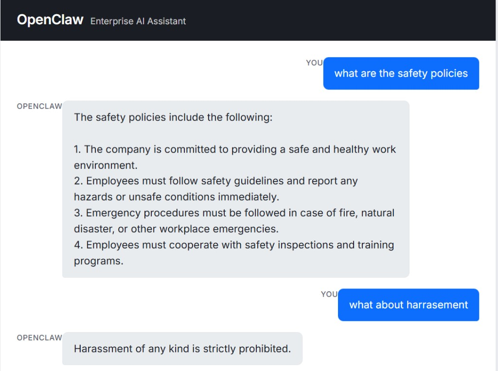

# OpenClaw Enterprise AI Assistant

An enterprise-grade AI chatbot that answers company policy questions, creates support tickets, sends notifications, and handles general conversation. Built with FastAPI, LangGraph, and OpenAI.



*OpenClaw answering questions about safety policies and harassment policy from the company knowledge base. Now with document upload support for RAG!*

## Features

- **📤 Document Upload** *(NEW)* — Upload documents (TXT, PDF, DOCX) directly through the UI to enhance the RAG knowledge base. Documents are automatically indexed and made searchable.
- **🧠 Intent-based routing** — Classifies queries as CHAT, KNOWLEDGE (policy/docs), or TOOL (tickets, notifications, reports) and routes to the right handler.
- **🔍 RAG over company policy** — Retrieves answers from your policy handbook (e.g. leave, safety, conduct, remote work) using a vector store (Chroma).
- **🛠️ Tool use** — Create support tickets, send notifications, and generate reports via the OpenClaw agent.
- **💬 Conversation memory** — Session-based history so the assistant keeps context within a conversation.
- **⚡ Streaming responses** — LLM responses are streamed for a natural, real-time feel.

## Project Structure

```
├── app/                 # FastAPI app and API routes
├── agents/              # LangGraph agent (tools)
├── config/              # Settings and model config
├── frontend/            # Chat UI (HTML, CSS, JS)
├── llm/                 # OpenAI client and prompts
├── memory/              # Session memory
├── rag/                 # Retriever and vector store (Chroma)
├── tools/               # Automation tools (tickets, notifications, reports)
├── workflows/           # LangGraph flow (intent → chat / RAG / agent)
└── build_vector_store.py  # Script to index company policy into the vector DB
```

## Setup

### 1. Clone and Install

```bash
git clone https://github.com/AshleyMathias/OpenClaw---Bot.git
cd OpenClaw---Bot
python -m venv venv
source venv/bin/activate   # Windows: venv\Scripts\activate
pip install -r requirements.txt
```

### 2. Environment Configuration

Create a `.env` file in the project root:

```
OPENAI_API_KEY=your_openai_api_key
```

### 3. Index Company Policy (Optional, for RAG)

You can either:

- **Use the build script:** Run `python build_vector_store.py` to index files from `rag/knoweldge/company_policy.txt`
- **Upload via UI:** Use the new document upload feature in the web interface to add documents directly!

### 4. Run the API

```bash
uvicorn app.main:app --reload
```

**API:** `http://127.0.0.1:8000`  
**Docs:** `http://127.0.0.1:8000/docs`

### 5. Use the Chat UI

Open `frontend/index.html` in a browser (or serve it from the same origin). The UI provides:

- Interactive chat interface with real-time responses
- Document upload button for adding files to the knowledge base
- Support for TXT, PDF, and DOCX file formats
- Session-based conversation history

## API Endpoints

| Method | Endpoint | Description |
|--------|----------|-------------|
| GET    | `/`      | Health / welcome message |
| GET    | `/health` | Health check endpoint |
| POST   | `/chat`  | Send a message. Query params: `message`, `session_id`. Returns `{"response": "..."}` |
| POST   | `/upload` *(NEW)* | Upload a document file. Accepts `file` (multipart/form-data). Supports TXT, PDF, DOCX. Returns `{"message": "..."}` |

## Usage Examples

### Chat Example

```bash
POST /chat?message=What is our leave policy?&session_id=user_123
```

### Upload Document Example

```bash
POST /upload
Content-Type: multipart/form-data

file: [your-document.pdf]
```

💡 **Tip:** Upload company policies, documentation, or any text-based documents to instantly enhance OpenClaw's knowledge base!

## Tech Stack

- **Backend:** FastAPI, LangGraph, LangChain, OpenAI
- **RAG:** Chroma (`langchain-chroma`), OpenAI embeddings
- **Frontend:** Vanilla JS, CSS (Inter font, responsive layout)

## License

MIT
